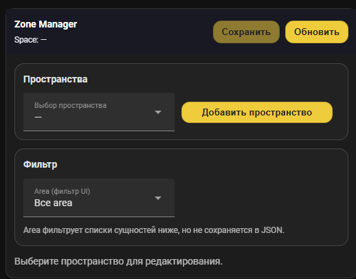

# Zone Manager — Home Assistant Integration + Lovelace Card

Zone Manager помогает конфигурировать **пространства** и **зоны освещения** с датчиками движения: вы собираете структуру в UI, а интеграция сохраняет её в JSON-файл. Дальше этот JSON удобно читать из автоматизаций и строить логику включения света по зонам и их “соседям”.

---

## ✨ Возможности

### Backend (интеграция)
- Хранение конфигурации в JSON (в `config/<ваш_файл>.json`).
- CRUD по пространствам/зонам через WebSocket API.
- Сервисы (например reload) для перечитывания JSON.
- Валидация при сохранении (защита от “мусора”) с понятными ошибками для UI.

### Frontend (Lovelace карточка)
- Выбор пространства и редактирование зон.
- Добавление/удаление пространств и зон.
- Списки выбора `sensor.*` и `light.*` с фильтром по Area (UI фильтр, в JSON не сохраняется).
- Поддержка “парных” списков и важности порядка (drag&drop).
- Аккуратный UI для светлой и тёмной темы Home Assistant.

---

## Service: `zone_manager.get_sensor_config`

Сервис ищет конфигурацию зоны по `entity_id` датчика в данных `zone_manager` (источник — `zone_manager.json`), и возвращает её в виде структуры, удобной для использования в автоматизациях.

### Зачем нужен
Home Assistant шаблонами не умеет удобно и безопасно “читать JSON с диска” прямо в автоматизации.  
`get_sensor_config` решает это, позволяя:
- взять `trigger.entity_id`
- получить соответствующую конфигурацию зоны
- передать нужные поля в вызываемые скрипты

### Входные параметры
- `entity_id` (обязательный): entity_id датчика, по которому нужно найти зону  
  Пример: `sensor.ms_4_1_4_3_state`
- `reload` (опциональный, bool, по умолчанию `false`): принудительно перечитать данные из файла перед поиском  
  Используйте, если ожидаете, что JSON был обновлён “только что”.

### Что возвращает (response data)
Сервис поддерживает response data и может использоваться с `response_variable`.

Возвращаемые поля:
- `found` — `true/false`, найдена ли зона
- `entity_id` — запрошенный entity_id
- `space` — имя пространства (для логов/диагностики)
- `zone` — “сырой” объект зоны (как в JSON)
- `neighbors` — список соседних датчиков
- `far_neighbors` — список дальних соседей
- `neighbor_groups` — список соседних групп света
- `light_group` — список групп света текущей зоны
- `light_group_single` — одиночная сущность группы света (`string`), если `light_group` содержит ровно 1 элемент  
  (удобно для сценариев, где скрипт ожидает строку)

## 🖼 Визуальный пример карточки
 
---

## 📦 Установка

### 📁 Вручную
1. Скопировать интеграцию:
   - `custom_components/zone_manager` → `/config/custom_components/zone_manager`

2. Скопировать карточку:
   - `www/zone-manager-card.js` → `/config/www/zone-manager-card.js`

3. Добавить ресурс Lovelace:
   - Настройки → Панели управления → Ресурсы → Добавить ресурс  
     URL: `/local/zone-manager-card.js?v=2.1.4`  
     Тип: `JavaScript Module`

4. Перезапустить Home Assistant.

---

## 🧩 Установка через HACS (Integration)

> Важно: в этом репозитории HACS ставит **только интеграцию**. Карточку нужно скопировать вручную в `/config/www/` (см. раздел “Вручную”).

1. HACS → Integrations
2. ⋮ → **Custom repositories**
3. Вставить URL репозитория, выбрать тип **Integration**
4. Install → перезапустить Home Assistant
5. Настройки → Устройства и службы → Добавить интеграцию → **Zone Manager**

---

## ⚙️ Настройка

### 1) Настройка интеграции
После установки добавьте интеграцию через UI. В Config Flow укажите путь к JSON-файлу (например):
- `/config/zone_manager.json`

### 2) Добавление карточки
#### Через UI
- “Добавить карточку” → выбрать **Zone Manager**.

#### Через YAML
```yaml
type: custom:zone-manager-card
```

### 3) Где хранится конфигурация

Интеграция сохраняет “источник истины” в JSON-файл, путь к которому вы указали в настройке интеграции.
Этот файл можно читать в автоматизациях.

## 🔖 Версия

Текущая версия: 2.1.4
История изменений: см. CHANGELOG.md.
